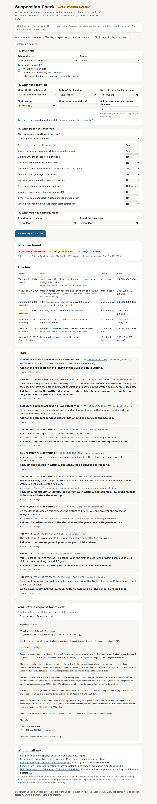

# Suspension Check: a rule-based AI for school discipline due process

**Suspension Check** is a free web tool for Illinois families, Local School
Councils, and parent groups. In **Family Check**, a parent answers a short
survey about a suspension, what paper the school handed them, and whether the
student has an IEP or 504 plan. The tool returns a school-day-aware deadline
timeline, flags that each cite the statute or regulation behind them, and a
plain-language letter asking for the review, meeting, or records the law owes
them. **Pattern Check** (planned) lets an LSC upload a discipline log and see
disparity summaries with small-cell suppression. Nothing a family types is
stored, every flag comes from an explicit, unit-tested rule, and there is no
chatbot anywhere in the decision path.

The engine underneath it is an open-source Python library (`suspension_check`): a
rule-based, explainable AI in the classic expert-system sense. Every conclusion
traces to a written rule and a statute; there is no machine-learning model or LLM
in the decision path.

> Built with the Chicago Education Advocacy Cooperative (ChiEAC).
> This is general information, not legal advice. Rule text is pending review by
> an attorney or experienced advocate. Synthetic data only.



## Status (alpha, end of build week 2)

| Area | State |
|---|---|
| Rule table v1 (26 rules: 17 Illinois, 9 federal) and deadline table | Done, `docs/legal/`. Quotes pending re-verification and legal review |
| Facts models, rule registry, three-valued evaluation | Done |
| School calendar (weekends, closures, JSON and .ics import) | Done. Bundled CPS 2026-27 calendar is **provisional** |
| Timeline state machine (main track + IDEA track) | Done |
| CLI: `suspension-check check`, `suspension-check rules` | Done |
| Tests: fixtures for every rule, Hypothesis property tests, letter goldens, no-persistence check | Done: 230 tests, 97% coverage |
| Synthetic discipline logs with expected metrics | Done, `synthetic/` |
| Review-request letter (plain text) | Early spike |
| Family Check web page + stateless API | Early spike (vanilla HTML, not yet deployed) |
| Redaction (Presidio), DOCX letters, other letter variants | Not started (Week 3) |
| CPS rule layer | Not started (needs current Code of Conduct) |
| Pattern Check metrics and upload | Not started (Week 5) |

See [docs/STATUS.md](docs/STATUS.md) for what is next and the open questions.

## Quick start

Requires Python 3.11+ and [uv](https://docs.astral.sh/uv/).

```bash
git clone https://github.com/Prakruthi19/suspension-check-rule-based-ai.git
cd suspension-check-rule-based-ai
uv sync --all-extras
uv run pytest                       # full suite with coverage gate
uv run suspension-check rules                # list every rule and its review status
uv run suspension-check check examples/scenario_b_iep_cumulative_twelve.json --today 2026-09-27
```

Run the web demo:

```bash
uv run uvicorn app.api.main:app --reload
# open http://127.0.0.1:8000 and click one of the synthetic examples
```

## The three demo scenarios (Gate 2)

| File | Scenario | Flags it should raise |
|---|---|---|
| `examples/scenario_a_two_day_no_notice.json` | Two-day out-of-school suspension, phone call only | IL-01 to IL-04 (Assert), IL-07, IL-09, IL-15 (Ask), IL-16 |
| `examples/scenario_b_iep_cumulative_twelve.json` | Seven-day suspension, student with an IEP, 12 cumulative days | IL-04, IL-05, IL-08 (Assert), FED-02/03 (Ask: pattern is a team call), FED-01, FED-09 |
| `examples/scenario_c_expulsion_hearing.json` | Expulsion recommended, certified-mail hearing notice received | IL-05 (Assert), IL-15, IL-16; hearing date on the timeline |

## How a rule looks

```python
@rule(
    id="IL-05",
    layer=Layer.ILLINOIS,
    citation="105 ILCS 5/10-22.6(b-20)",
    url=SOURCES["ILCS_10_22_6"],
    quote="...may be used only if other appropriate and available behavioral and "
    "disciplinary interventions have been exhausted...",
    flag="A suspension longer than three school days ... requires the school to have tried "
    "other interventions first and to say so in the written decision. Yours does not.",
    action="Ask in writing for the written decision to state which interventions were attempted...",
    severity=Severity.ASSERT,
)
def long_suspension_requires_exhausted_interventions(f: Facts) -> bool | None:
    in_scope = _long_oss(f, 3) or f.removal.kind in {RemovalKind.ALTERNATIVE, RemovalKind.EXPULSION}
    return in_scope and is_no(f.notice.documents_interventions)
```

A predicate returns `True` (fires), `False` (silent), or `None` (the parent
answered "Not sure"). `None` downgrades an Assert to an Ask, so the tool never
accuses a school on a fact nobody knows. Every rule has a `_fires.json` and a
`_silent.json` fixture in `tests/fixtures/rules/`; the suite fails if either is
missing. See [ARCHITECTURE.md](ARCHITECTURE.md).

## Privacy

No database, no files written, no sessions. The API validates in memory and
logs only a request ID, timing, and rule IDs. `tests/test_no_persistence.py`
fails the build if library or app code imports a storage client or opens a
file for writing.

## License

Apache-2.0. Author: Prakruthi Koteshwar. Sponsoring organization: Chicago
Education Advocacy Cooperative.
